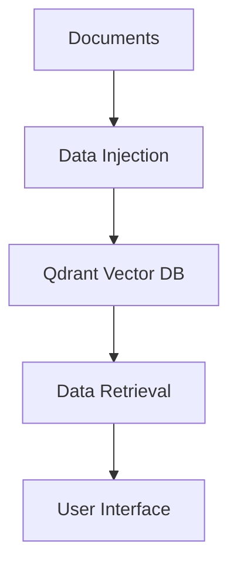

# Qdrant RAG Pipeline

A complete implementation of a Retrieval-Augmented Generation (RAG) pipeline using Qdrant vector database, featuring document injection and semantic search capabilities.


## Features

- **Document Processing**: Supports multiple file formats (PDF, DOCX, CSV, JSON, etc.)
- **Vector Embeddings**: Uses state-of-the-art sentence transformers
- **Hybrid Search**: Combines semantic and keyword search
- **Analytics Dashboard**: Track search performance and patterns
- **Security**: Input validation and sanitization
- **Health Monitoring**: System resource tracking

## Components

1. **Data-Injection.py**: Ingests and processes documents into Qdrant collections
2. **Data-Retrieval.py**: Interactive search interface with analytics
3. **config.yaml**: Centralized configuration for all components

## Installation

```bash
# Clone the repository
git clone https://github.com/yourusername/qdrant-rag-pipeline.git
cd qdrant-rag-pipeline

# Install dependencies
pip install -r requirements.txt

# Download spaCy model
python -m spacy download en_core_web_sm
```

## Configuration

Edit `config.yaml` to customize:

```yaml
qdrant:
  host: "localhost"  # Qdrant server address
  port: 6333         # Qdrant port

model:
  name: "all-MiniLM-L6-v2"  # Embedding model
  device: "cpu"             # cpu/cuda/mps

processing:
  chunk_size: 500           # Text chunk size
  supported_extensions:     # File types to process
    - ".pdf"
    - ".docx"
    - ".txt"

Input Directory
input_dir: "file\\path\\docs"  # Custom path to your documents folder
```

## Usage

### 1. Inject Documents
```bash
python Data-Injection.py
```

### 2. Search Interface
```bash
python Data-Retrieval.py
```

## System Architecture



## License

[MIT](LICENSE)
